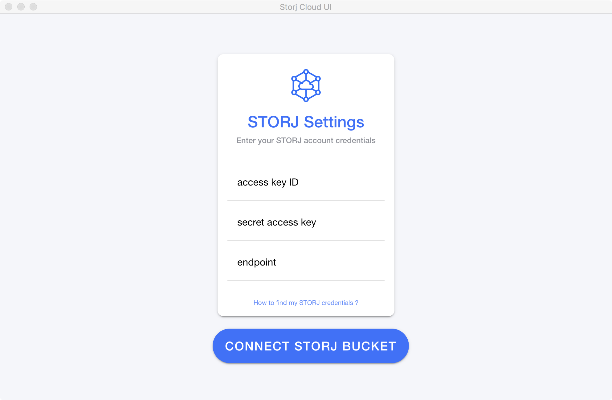
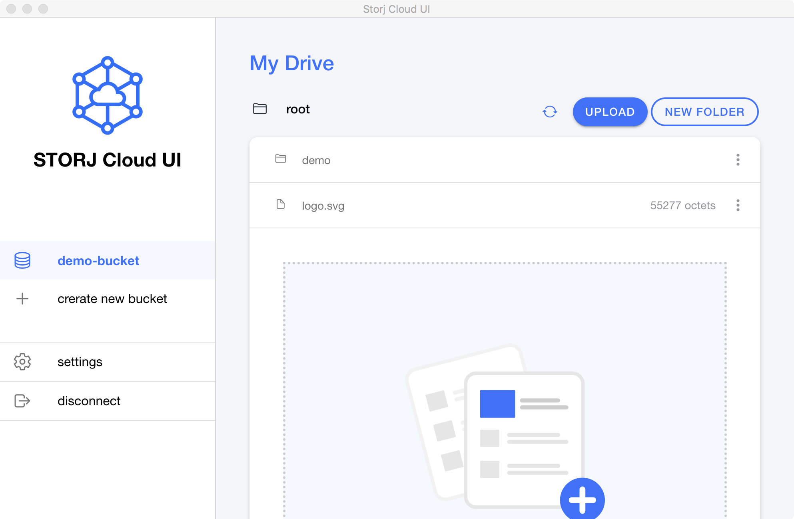

# Storj Cloud Ui
> Storj Cloud Ui is a cross platform ui application that allows users to upload, download and manage files from the Storj network. It's a free and open source application.

## 👀 Overview

## 🚀 Features
- [x] Create storage buckets to the Storj network
- [x] Create folders to the Storj network
- [ ] Delete folders to the Storj network
- [x] Upload files to the Storj network from your computer
- [x] Download files from the Storj network to your computer
- [x] Delete files from the Storj network
- [x] Create web url links to share files
- [ ] Open file preview in app
- [x] Local data encryption
- [x] Dark mode support

## ⚙️ Installation

To [download the latest version](https://github.com/FazioNico/storj-cloud-ui/releases) of Storj Cloud Ui, go to release page and download the latest version from desired available platform (MacOS, Windows, Linux).

You can also use the web browser version of Storj Cloud Ui by following the links below:
  - Web browsers: [https://fazionico.github.io/storj-cloud-ui](https://fazionico.github.io/storj-cloud-ui)
  - Mobile (pwa): 

## Usage

  - Download the latest version of Storj Cloud UI for your platform
  - Create a free account at [storj.io](https://storj.io) if you don't have one
  - Login to your [STOJ DCS account](https://eu1.storj.io/login)
  - Generate Credentials to the STORJ Gateway MT [Quick guid](https://docs.storj.io/dcs/getting-started/quickstart-aws-sdk-and-hosted-gateway-mt/)
  - Run the Storj Cloud UI application
  - Connect to the Storj network using the generated credentials
  - Create a bucket to the Storj network if you don't have one
  - Congratulations! You're ready to start using Storj Cloud UI

## Development

  - Clone the Storj Cloud UI repository
  - Install dependencies using NodeJS and NPM
  - Install Nx Workspace CLI to manage workspace project
  - Run develooppment server using `nx serve storj-cloud--browser` command will open the Storj Cloud UI application in the browser

## Build 

  - Run `nx build storj-cloud--browser` to build the Storj Cloud UI application for the browser
  - Run `npm run build:desktop` to build the Storj Cloud UI Desktop application

## Packaging

  - Run `npm run make:desktop` to package the Storj Cloud UI Desktop application. This will create a zip file that contains the Storj Cloud UI Desktop application and all the required dependencies. You have to run `build:desktop` before running `make:desktop` to ensure that the application is built with the latest version of all dependencies.
  
You can use optional flags to customize the package. 
For example, `npm run make:desktop -- -l -m -w` will create a zip file that contains the Storj Cloud UI Desktop application and all the required dependencies.

Optionnal parameters:
  - `-l`: generate Linux package
  - `-m`: generate MacOS package
  - `-w`: generate Windows package
  - `--publish always`: publish the package to github

> If no flags are specified, the default behavior is to generate a zip with for the current platform on which the command is executed

## 💻 Contributing

Thanks for taking the time to help out and improve Storj Cloud Ui! 🎉

The following is a set of guidelines for Storj Cloud Ui contributions and may change over time. Feel free to suggest improvements to this document in a pull request!

See [CONTRIBUTING.md](CONTRIBUTING.md)

## 📃 License

See [LICENSE](LICENSE)